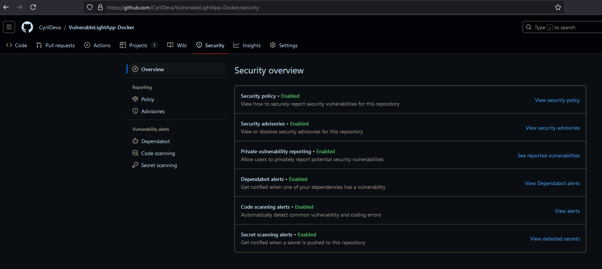
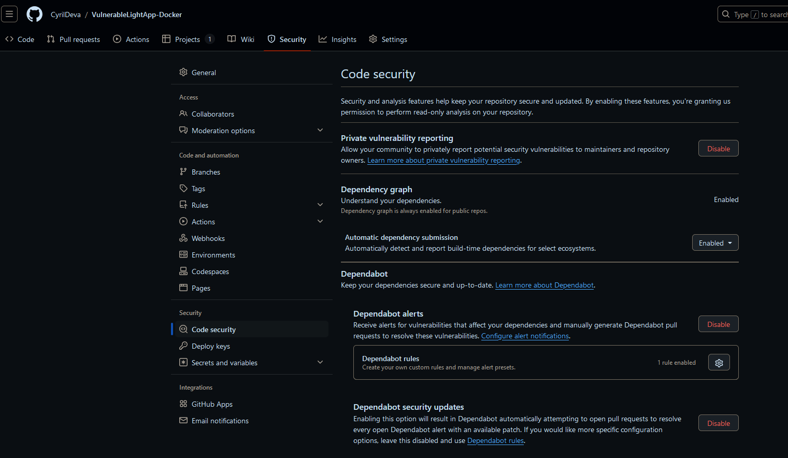
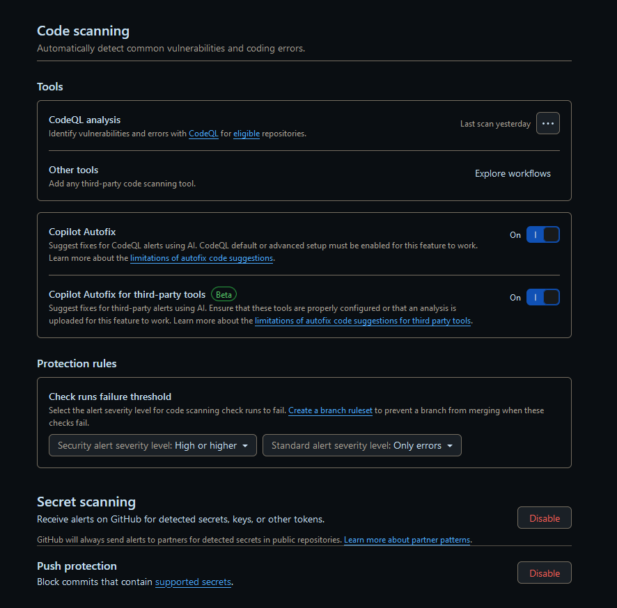
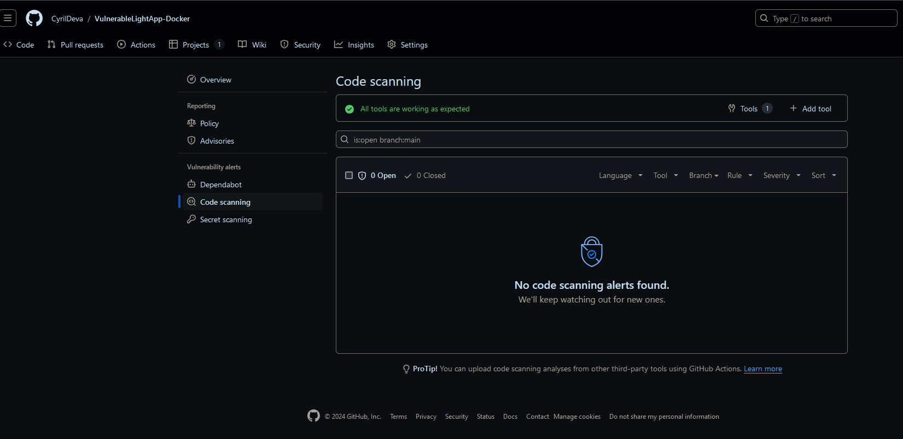
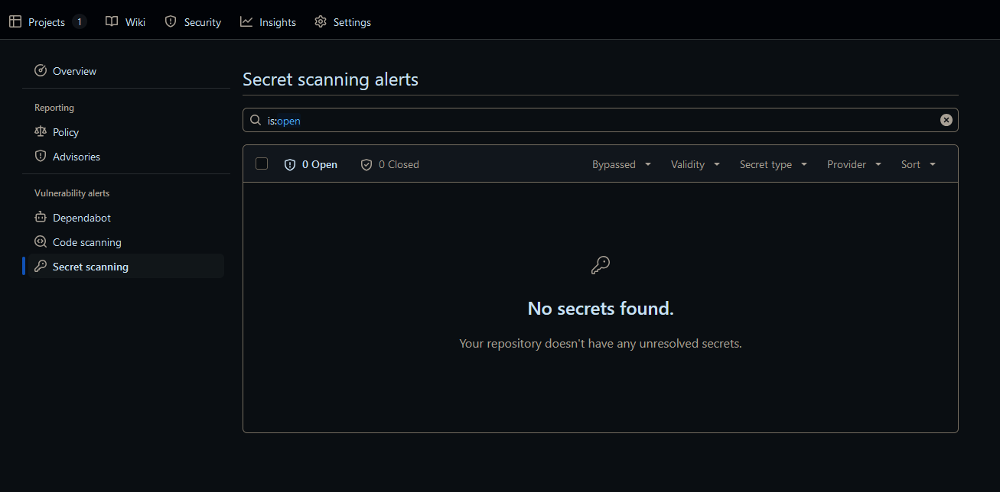

# Correction Audit GitHub 

## Objectif

Réaliser un audit de sécurité sur le dépôt GitHub du Backend de l'application .NET afin d'identifier les mauvaises pratiques et d'améliorer la sécurité. Ce rapport détaillera chaque étape de l’audit, en expliquant l’utilisation des outils spécifiques demandés.

## 1. Sécurité des Dépôts - Analyse des Données Sensibles

### Objectif
Vérifier si des données sensibles sont exposées dans le code ou les fichiers de configuration.

### GitHub
Sur GitHub, des outils sont deja présent pour effectuer des vérifications.
Dans le dépot, onglet securité

#### Code Scanning

#### Secret Scanning

