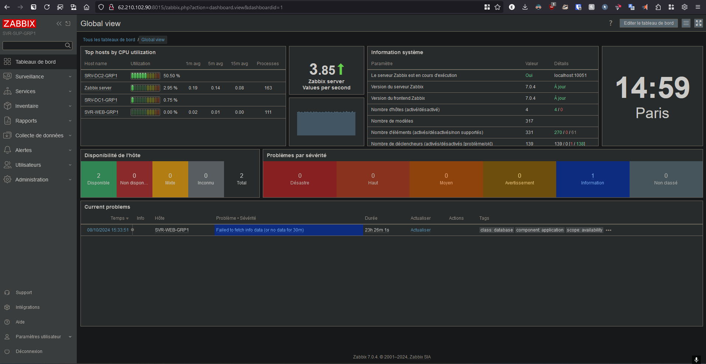
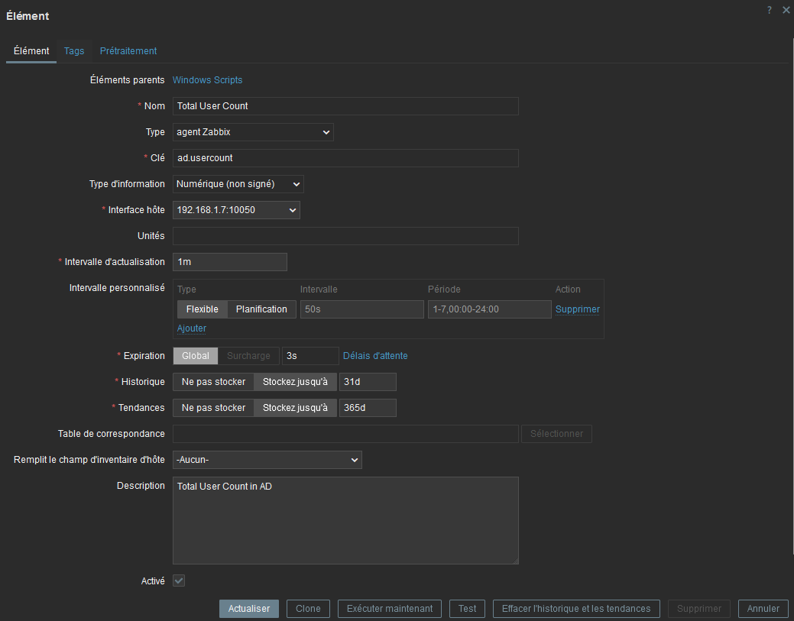
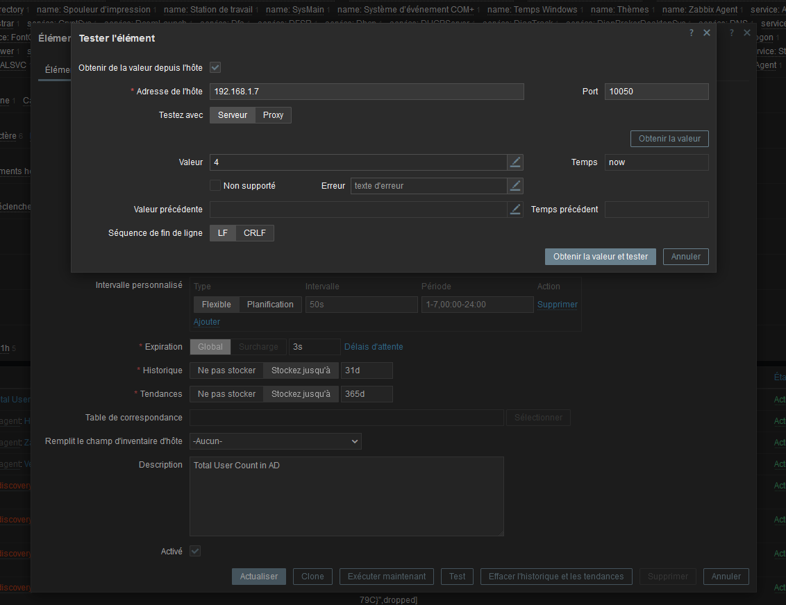
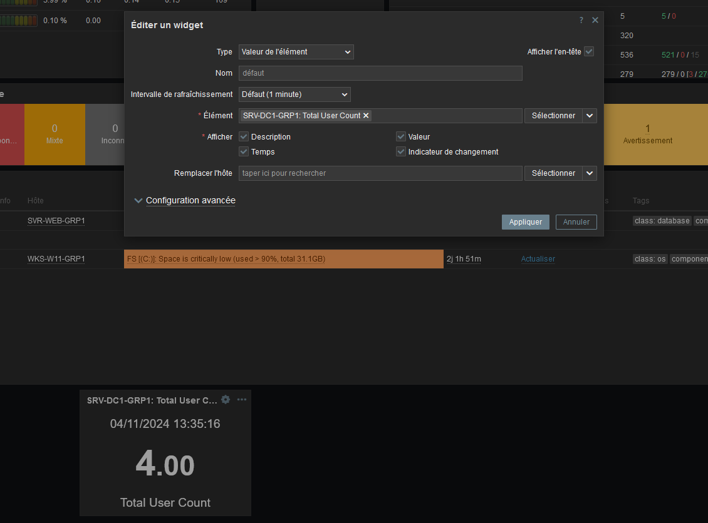

# Zabbix

## Tableau de bords Zabbix



# Objectif: Avoir le nombre d'utilisateur AD

## Ajout d'un script pour compter les users dans l'AD

Creer un script sur le server dont on veux monitorer. 
ex : C:\scripts\Get-TotalUserCount.ps1

## Contenu du script Get-TotalUserCount.ps1
```
Count all users in the domain
(Get-ADUser -Filter *).Count
```

## Configuration de l'agent Zabbix
Sur la machine avec l'agent
dans "C:\Program Files\Zabbix Agent\zabbix_agentd.conf"
ajouter les ligne suivante : 

```
# Enable remote command execution (if not already enabled)
EnableRemoteCommands=1

# Allow the agent to run PowerShell scripts
UserParameter=ad.usercount,powershell -NoProfile -ExecutionPolicy Bypass -File "C:\scripts\Get-TotalUserCount.ps1"
```


## Configuration sur l'interface web Zabbix
Creer un item dans : 
Hôtes > Eléments > Créer un élément




Tester l'élément:


Verifier que la valeur renvoyé est correct.

## Ajouter le widget dans le tableau de bord
