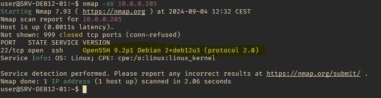

# Rapport de Projet : Sécurité et Détection des Intrusions avec Snort 3

# Phase de Préparation

## Configuration de règles Snort 3

Pour préparer la défense, nous avons configuré Snort 3 avec les règles suivantes pour détecter les attaques courantes :

 **Détection des tentatives de connexion SSH suspectes** :

```alert icmp any any -> any any ( msg:"ICMP Traffic Detected"; sid:10000001; metadata:policy security-ips alert; )```


**Détection des tentatives de ping pour Dos** :

```alert icmp any any -> any any ( msg:"ICMP Traffic Detected"; sid:10000001; metadata:policy security-ips alert; )```


# Phase d'attaque
## Reconnaissance
Lancement de nmap pour trouver les ports ouvert et potentiellement la version des applications



## Brute force avec une wordlist

Brute force de SSH avec une liste de mot de passe


# Phase de defense

Detection de tentative de connection en SSH


## Solutions

Pour mitiger ceci on peux changer le port SSH par defaut, meme si il peux être detecté par Nmap

Dans la Config de SSH on peux refuser la connection au bout dans quelque tentatives

Blocker l'ip de l'attaquant directement

Choisir un mot de passe robuste
